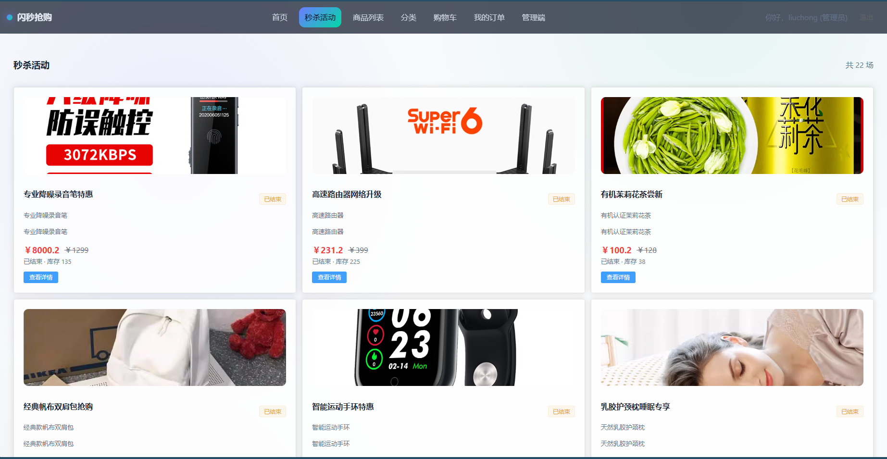
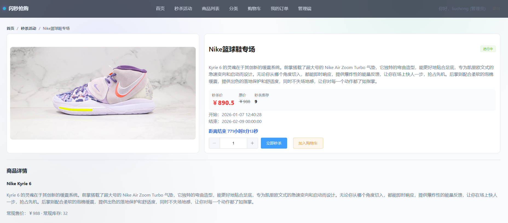
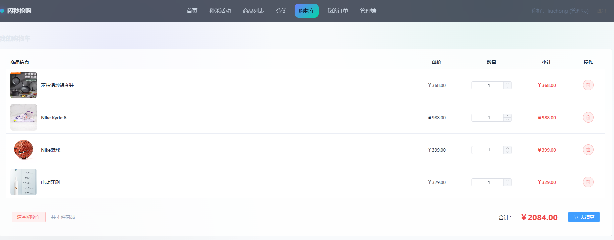
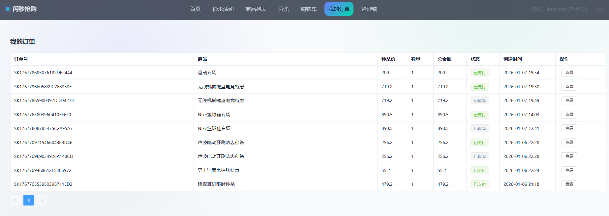
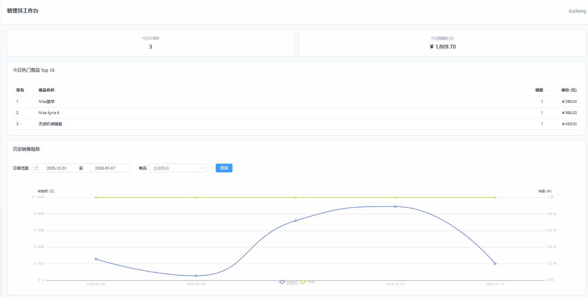

# hadoop-mall

  <h1>⚡ HBase & Redis 秒杀电商系统</h1>
  <h3>基于异构双层存储架构的高并发在线销售系统</h3>

  

    
    
    
    
    
  

---

## 📖 项目背景 (Background)

随着互联网电商业务的爆发，传统的关系型数据库（如 MySQL）在面对**亿级历史订单存储**和**秒杀场景下的瞬间高并发写入**时，往往面临巨大的性能瓶颈。

本项目旨在构建一个**高性能、高可用、可扩展**的电商销售系统。通过引入 **HBase（分布式列式存储）** 和 **Redis（高性能内存数据库）** 构建混合存储架构，有效解决了海量数据存储与高并发读写之间的矛盾。

---

## 🌟 核心亮点 (Key Features)

*   **双层存储架构**：
    *   **Redis** 作为一级缓存，承担秒杀扣减、购物车高频读写、实时榜单计算，保证毫秒级响应。
    *   **HBase** 作为二级持久化存储，利用 RowKey 和列族特性存储海量商品、订单及历史销售数据。
*   **高并发秒杀解决方案**：
    *   **库存预热**：活动开始前将库存加载至 Redis。
    *   **分布式锁**：使用 Redisson 防止超卖。
    *   **异步削峰**：采用“缓存扣减 + 异步落库”策略，保护底层数据库。
*   **购物车“最终一致性”设计**：采用“Redis 实时读写 + Spring `@Async` 异步同步 HBase”策略，既保证了操作的丝滑体验，又防止了数据丢失。
*   **实时数据分析**：利用 Redis 的原子计数器和 ZSet 滑动窗口，实现销售大屏秒级刷新和热销商品实时排行。

---

## 🛠️ 技术架构 (Technical Architecture)

### 💻 技术栈

| 模块 | 技术选型 | 说明 |
| :--- | :--- | :--- |
| **后端框架** | **Spring Boot** | 核心业务逻辑与 RESTful API |
| **大数据存储** | **Apache HBase** | 存储商品、订单、购物车历史数据 (列式存储) |
| **高速缓存** | **Redis** | 秒杀库存、购物车缓存、实时榜单、分布式锁 |
| **文件存储** | **MinIO** | 分布式对象存储，用于商品图片管理 |
| **前端框架** | **Vue 3 + ECharts** | 响应式界面与实时数据可视化 |
| **安全认证** | **Spring Security + JWT** | 无状态身份认证与 RBAC 权限控制 |

### 📐 数据库设计 (Schema Design)

针对 HBase 的特性，进行了精细化的 RowKey 与列族设计，以优化 I/O 性能：

*   **商品表 (`product_info`)**:
    *   `cf_base`: 基础信息 (高频)
    *   `cf_detail`: 描述、图片 (低频大字段)
    *   `cf_stock`: **独立列族存储库存**，优化秒杀写入性能
*   **购物车表 (`cart_data`)**:
    *   利用 HBase **动态列 (Wide Column)** 特性，`cf_items` 列族下每一列对应一个商品，实现无模式扩展。
*   **销售数据表 (`sales_data`)**:
    *   RowKey: `yyyy-MM-dd_productId`，利用字典序特性支持按日期范围快速扫描。

---

## 📦 功能模块 (Modules)

### 1. 🛍️ 商品管理
*   支持海量商品存储与多维检索。
*   集成 MinIO 实现图片上传。
*   HBase 列族垂直拆分，实现冷热数据分离。

### 2. ⚡ 秒杀与订单
*   **防超卖**：Redisson 分布式锁 + Redis 原子递减。
*   **限流保护**：基于用户维度的接口限流。
*   **状态机管理**：严格的订单状态流转（未支付 -> 已支付/取消）。

### 3. 🛒 高性能购物车
*   **读写策略**：Redis Hash 结构存储，操作耗时 < 20ms。
*   **持久化**：异步线程将 Redis 快照同步至 HBase，保障数据安全。

### 4. 📊 实时销售分析
*   **实时看板**：基于 Redis 原子计数器的 GMV 和订单数统计。
*   **热销排行**：利用 Redis ZSet 实现 TopN 商品实时排名。

---

## 📸 系统演示 (Screenshots)

### 1. 秒杀活动与商品详情

### 2. 购物车与订单结算

### 3. 实时销售数据看板

---

## 🚀 快速开始 (How to Run)

### 环境依赖
*   JDK 1.8+
*   Hadoop & HBase 集群 (全分布式)
*   Redis 6.0+
*   MinIO Server

### 启动步骤
1.  **配置环境**：在 `application.yml` 中配置 HBase Zookeeper 地址、Redis 地址及 MinIO 信息。
2.  **初始化表**：项目启动时，`HBaseTableInitializer` 会自动检测并创建所需的 HBase 表结构。
3.  **启动后端**：运行 `Application.java`。
4.  **启动前端**：进入 `frontend` 目录，执行 `npm install && npm run dev`。

---

## 💡 为什么使用 HBase + Redis？

| 特性 | 传统 MySQL 方案 | 本项目 (HBase + Redis) |
| :--- | :--- | :--- |
| **并发写能力** | 受限于 B+树索引，秒杀时易锁表 | Redis 单线程原子操作 + HBase LSM 树高吞吐写入 |
| **数据扩展性** | 分库分表复杂 | HBase 天然支持水平扩展，动态列支持灵活业务 |
| **购物车设计** | 需独立条目表，数据量大查询慢 | HBase 单行存储用户所有购物车项，读取仅需一次 IO |

---

## 📧 联系我 (Contact)
*   **Email**: [3356253976@qq.com]
*   **GitHub**: [https://github.com/liuchongliu35-ctrl]

---

